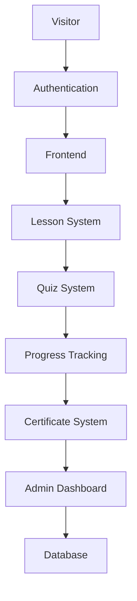
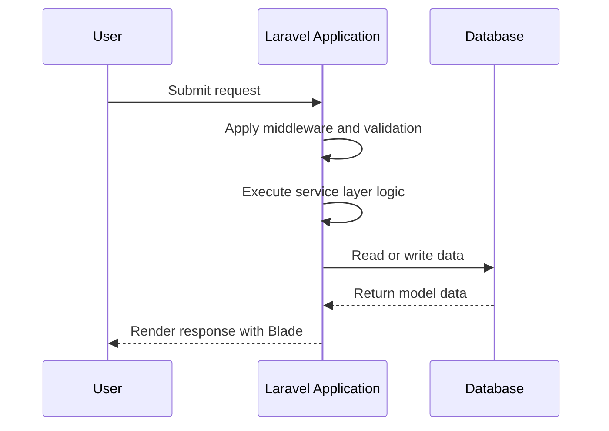

# System Architecture

## Architecture Overview

Frontend Academy is a web-based learning platform designed to deliver structured frontend education through a cohesive, maintainable, and extensible application. The system architecture is intentionally centered on a single, well-organized Laravel application rather than a distributed set of independently deployed services. This choice supports the project’s current goals: rapid delivery of educational features, clear ownership of business logic, straightforward administration, and a documentation-first development workflow.

Laravel Blade was selected as the primary rendering approach because the platform’s initial scope is content-driven, form-heavy, and user-oriented rather than highly interactive in the sense of a large single-page application. Blade provides a secure, straightforward, and convention-based way to render server-side views while retaining the flexibility to introduce richer client-side interactions only where they add real value. It also aligns with the project’s emphasis on maintainability, accessibility, and predictable development patterns.

A monolithic architecture is currently preferred over microservices for three primary reasons:

- The product is still being shaped, and the initial focus is on building a solid foundation for courses, lessons, quizzes, progress tracking, and administration.
- A monolith reduces operational complexity and allows the team to iterate faster without introducing service-to-service coordination overhead.
- The domain is cohesive: authentication, content delivery, assessment, and progress tracking are tightly related and benefit from shared data models and a unified development model.

This architecture can evolve over time. The system may eventually expose APIs for mobile applications, third-party integrations, or richer frontend experiences. However, such evolution should be introduced incrementally and only after the core platform has matured and a clear need for decomposition has emerged.

## Architectural Principles

The architecture is guided by the following principles:

- Simplicity: The system should remain understandable to both human developers and AI agents. Complexity must be justified by clear product needs.
- Scalability: The design should support growth in users, course content, and feature breadth without forcing a major rewrite.
- Maintainability: Code should be structured so that future contributors can change behavior safely and confidently.
- Separation of Concerns: Presentation, business logic, validation, and persistence should remain distinct.
- Single Responsibility Principle: Each module, class, and service should have a clear and narrow purpose.
- Reusability: Shared UI, logic, and patterns should be centralized rather than duplicated across the codebase.
- AI-Friendly Development: Documentation, naming, and structure must remain understandable and machine-readable enough to support responsible automation.
- Convention over Configuration: Standard Laravel conventions should be favored over bespoke patterns unless there is a compelling reason to deviate.
- Progressive Enhancement: Core functionality must work reliably without excessive JavaScript, while richer interactions can be layered in progressively.

## High-Level System Diagram

The following diagram illustrates the primary flow of the platform from the public entry point to the persistence layer.



This flow shows that the system is organized around a user-centered experience in which authentication governs access, the frontend presents learning content, and the supporting modules collectively manage assessment, progression, recognition, and administration.

## User Roles

The platform will support a clear set of roles that align with the product’s educational and administrative needs.

### Guest

A guest is an unauthenticated visitor who can browse public content, view introductory material, and explore the general structure of the platform. Guests should not be able to access protected course material, learner progress, or administrative tools.

Responsibilities:
- Discover the platform and its educational value.
- View public pages and public course summaries.
- Begin onboarding into the learning experience.

Permissions:
- Limited to public-facing content.

### Student

A student is an authenticated learner who can enroll in courses, access lessons, submit quizzes, complete exercises, track progress, bookmark content, and receive achievements or certificates. Students are the primary target audience of the product.

Responsibilities:
- Progress through learning content.
- Complete assessments and exercises.
- Maintain personal learning records.
- Interact with personalized learning state such as bookmarks and progress.

Permissions:
- Access to learner-specific content and progress data.
- Limited access to administration and management features.

### Administrator

An administrator manages the platform’s operational health, content integrity, user accounts, and system configuration. Administrators oversee the maintenance and quality of the educational experience.

Responsibilities:
- Manage users and roles.
- Moderate platform content and configuration.
- Review platform activity and operational metrics.
- Support governance, security, and stability.

Permissions:
- Access to administrative tools and elevated management capabilities.

### Future Instructor

The instructor role is expected to be introduced in a later phase. Instructors will support course delivery, content authoring, learner guidance, and assessment oversight. They may help publish and refine curriculum while remaining separate from full administrative control.

Responsibilities:
- Create or maintain learning content.
- Guide learners within assigned courses or pathways.
- Review learner submissions and provide feedback where applicable.

Permissions:
- Access to content-management workflows for assigned educational material.
- Limited or scoped administrative authority depending on the maturity of the role model.

### Future Moderator

The moderator role is also intended for a later phase. Moderators will help maintain a healthy and constructive learning environment by supporting community governance and content quality.

Responsibilities:
- Review flagged content or reports.
- Support safe and respectful interactions.
- Help enforce platform policies where applicable.

Permissions:
- Limited moderation tools and oversight capabilities.
- No unrestricted administrative access unless explicitly granted.

## System Modules

The platform is organized into distinct modules that reflect the core product experience and its future growth potential. Each module owns a specific responsibility and must remain aligned with the overall architectural boundaries.

### Authentication

- Purpose: Secure access to the platform and protect user-driven workflows.
- Responsibilities: Registration, login, logout, password recovery, session handling, and role-aware access.
- Dependencies: User Profile, Settings, Admin Dashboard, Notification.
- Data ownership: User identity, session state, authentication metadata.
- Future expansion possibilities: Social login, multi-factor authentication, passwordless authentication, and identity federation.

### User Profile

- Purpose: Maintain user identity, preferences, and account information.
- Responsibilities: Profile management, account updates, preferences, and learner identity presentation.
- Dependencies: Authentication, Settings, Notification.
- Data ownership: Profile fields, user preferences, public and private account metadata.
- Future expansion possibilities: Richer profile customization, avatar management, public portfolios, and learning preferences.

### Course Management

- Purpose: Organize and publish learning content in a structured way.
- Responsibilities: Create and manage courses, define curriculum structure, control content visibility, and maintain learning order.
- Dependencies: Lesson Management, Search, Admin Dashboard, Roadmap.
- Data ownership: Course definitions, curriculum relationships, publication status.
- Future expansion possibilities: Course versions, multilingual content, cohort-based delivery, and dynamic pathing.

### Lesson Management

- Purpose: Deliver educational content to learners in a consistent format.
- Responsibilities: Present lessons, maintain sequencing, manage lesson metadata, and support content rendering.
- Dependencies: Course Management, Progress Tracking, Search.
- Data ownership: Lesson content, lesson order, associated learning resources.
- Future expansion possibilities: Interactive lessons, downloadable content, branching paths, and media-rich formats.

### Roadmap

- Purpose: Guide learners through a clear path of progression.
- Responsibilities: Define learning sequences, connect concepts to content, and help learners understand where they are in their journey.
- Dependencies: Course Management, Progress Tracking, Achievements.
- Data ownership: Roadmap definitions, learner progress against roadmap milestones.
- Future expansion possibilities: Personalized roadmaps, adaptive recommendations, and goal-based planning.

### Quiz Engine

- Purpose: Evaluate learner understanding through structured assessments.
- Responsibilities: Create questions, record submissions, calculate results, and provide feedback.
- Dependencies: Lesson Management, Progress Tracking, Certificates.
- Data ownership: Questions, answers, submissions, scores, review metadata.
- Future expansion possibilities: Adaptive quizzes, timed assessments, item banks, and analytics-driven difficulty tuning.

### Coding Exercises

- Purpose: Provide hands-on programming challenges that reinforce practical frontend skills.
- Responsibilities: Manage exercises, validate submissions, track outcomes, and associate results with learner progress.
- Dependencies: Lesson Management, Progress Tracking, User Profile.
- Data ownership: Exercise definitions, submission records, evaluation outcomes.
- Future expansion possibilities: Automated grading, sandboxed execution, and multiple exercise formats.

### Project Library

- Purpose: Offer learners practical projects that demonstrate applied frontend development.
- Responsibilities: Curate projects, relate them to learning paths, and support project discovery.
- Dependencies: Course Management, Search, Progress Tracking.
- Data ownership: Project metadata, relationship to courses or roadmaps, learner engagement state.
- Future expansion possibilities: Learner submissions, portfolio integration, templates, and community showcases.

### Bookmark System

- Purpose: Let learners save content for later review.
- Responsibilities: Create, list, remove, and organize bookmarks across lessons, exercises, and projects.
- Dependencies: User Profile, Search, Progress Tracking.
- Data ownership: Bookmark records tied to users and content entities.
- Future expansion possibilities: Curated collections, collaborative bookmarks, and recommendation-driven study sets.

### Achievements

- Purpose: Encourage engagement and recognize milestones.
- Responsibilities: Define achievement rules, trigger unlock conditions, and present recognition to learners.
- Dependencies: Progress Tracking, Certificates, Notification.
- Data ownership: Achievement definitions, unlock records, display metadata.
- Future expansion possibilities: Streaks, badges, badges-by-level, and challenge-based rewards.

### Certificates

- Purpose: Recognize completed learning outcomes and provide formal completion evidence.
- Responsibilities: Track completion criteria, issue certificates, and present credential information to users.
- Dependencies: Progress Tracking, Achievements, User Profile.
- Data ownership: Certificate definitions, issuance records, learner completion state.
- Future expansion possibilities: Verification links, shareable credentials, bulk issuance, and richer certification workflows.

### Progress Tracking

- Purpose: Provide a clear view of learner advancement and completion state.
- Responsibilities: Record completed lessons, quizzes, exercises, and milestones; compute state changes and progress summaries.
- Dependencies: Lesson Management, Quiz Engine, Coding Exercises, Achievements, Certificates.
- Data ownership: Completion history, progress snapshots, milestone records.
- Future expansion possibilities: Detailed analytics, streak tracking, mastery levels, and predictive recommendations.

### Search

- Purpose: Help users find the right content quickly.
- Responsibilities: Index and retrieve relevant modules, lessons, projects, and learning pathways.
- Dependencies: Course Management, Lesson Management, Project Library.
- Data ownership: Search indexes and derived metadata.
- Future expansion possibilities: Faceted filters, semantic search, and personalized relevance ranking.

### Notification

- Purpose: Keep users informed about important events and updates.
- Responsibilities: Send system notifications, email events, reminders, and milestone alerts.
- Dependencies: User Profile, Progress Tracking, Achievements, Admin Dashboard.
- Data ownership: Notification templates, delivery records, user preferences.
- Future expansion possibilities: Preference-based channels, event-driven automation, and richer messaging workflows.

### Admin Dashboard

- Purpose: Provide operational oversight and management tools for the platform.
- Responsibilities: Manage content, review users, inspect platform activity, and oversee system configuration.
- Dependencies: User Profile, Course Management, Notification, Settings.
- Data ownership: Operational configuration, moderation data, audit-oriented metadata.
- Future expansion possibilities: Reports, analytics panels, workflow automation, and team-based administration.

### Settings

- Purpose: Centralize configuration that affects user experience or platform behavior.
- Responsibilities: Manage account preferences, notification preferences, and general platform options.
- Dependencies: User Profile, Notification, Authentication.
- Data ownership: Preference records and configuration values.
- Future expansion possibilities: Localization, organization-level configuration, and role-specific settings.

## Request Lifecycle

A typical request in Frontend Academy follows a predictable Laravel flow. This lifecycle is intentionally simple so that responsibilities remain easy to understand and maintain.

```text
Browser
↓
Route
↓
Middleware
↓
Controller
↓
Service
↓
Model
↓
Database
↓
Blade View
↓
Browser
```

Layer responsibilities:

- Browser: Sends the initial request and receives the rendered response.
- Route: Maps the request to the appropriate controller action.
- Middleware: Applies concerns such as authentication, authorization, CSRF protection, maintenance checks, and request shaping.
- Controller: Receives the request, delegates work, and prepares a response.
- Service: Executes the core domain logic and coordinates rules, calculations, transformations, or workflow steps.
- Model: Represents data entities and encapsulates persistence-related behavior.
- Database: Stores and retrieves application data using relational tables.
- Blade View: Renders the final presentation using layout, component, and partial composition.

This flow reflects the project’s architectural preference for thin controllers and service-oriented business logic.

## Directory Responsibilities

The Laravel application structure will remain conventional and predictable. The following directories define the main responsibilities of the codebase.

### app/

The application layer contains the core business logic, HTTP layer, domain services, models, policies, and supporting classes. Custom domain directories will be organized under structured namespaces such as:

- app/Services/ for application services.
- app/Http/Requests/ for form requests and request validation.
- app/Policies/ for authorization policy classes.
- app/Support/ for reusable helper or integration classes.
- app/Jobs/ and app/Listeners/ for queued or event-driven interactions when needed.

### bootstrap/

Contains the framework bootstrapping logic and the application service provider initialization path. It should remain mostly framework-managed and not carry business-specific implementation logic.

### config/

Stores the platform’s configuration values, including service settings, mail configuration, app behavior, and environment-based options. Configuration should be centralized and explicit.

### database/

Contains schema definitions, migrations, seeders, and factories. This directory is the home of the platform’s data evolution strategy and test data preparation.

### public/

Contains the web entry point and public assets such as compiled CSS, JavaScript bundles, and uploaded files that must be directly accessible by the browser.

### resources/

Contains templates, frontend assets, and UI resources. The primary responsibilities are:

- resources/views/ for Blade templates, layout files, components, and partials.
- resources/css/ and resources/js/ for frontend asset source code.
- resources/lang/ for localization resources if introduced later.

### routes/

Contains route definitions for the web and API surface of the application. Route organization should remain explicit and aligned with the module boundaries.

### storage/

Stores generated files, cache data, logs, compiled views, and other runtime or user-generated artifacts. It should be treated as a runtime workspace rather than a source code location.

### tests/

Contains automated tests that validate behavior, protect architecture boundaries, and ensure new features do not regress existing capabilities.

## Business Logic Strategy

Business logic should remain outside the request layer. Controllers must remain thin and delegate meaningful work to services. This practice keeps controllers easy to read and prevents them from becoming a dumping ground for application rules.

The expected responsibility split is as follows:

- Controllers: Receive input, coordinate flow, and return responses.
- Services: Contain business rules, orchestration, and reusable domain behavior.
- Form Requests: Handle validation and authorization concerns for incoming data.
- Models: Represent entities and encapsulate persistence logic and relationships.
- Repositories: May be introduced later if the data access layer becomes complex enough to warrant them, but they should be adopted deliberately and not as a default for simple cases.
- Blade: Should contain presentation logic only, with minimal application behavior and no business-rule implementation.

## Rendering Strategy

Blade is the selected rendering strategy because it fits the project’s current requirements for a server-rendered experience that is secure, maintainable, and easy to reason about.

### Blade Layouts

Layouts provide the shared structural shell of the application, including navigation, page wrappers, and common chrome.

### Blade Components

Components should be used for reusable UI units such as cards, buttons, form groups, lesson summaries, badges, and navigation elements.

### Blade Partials

Partials should be used for repeated content fragments such as page headers, lesson navigation, flash messages, and modal bodies.

### Reusable UI

The frontend should favor reuse and consistency. Shared UI elements should be centralized so the entire platform presents a coherent experience.

### View Composers (Future Possibility)

View composers may be introduced later to share data preparation across views without leaking logic into the templates themselves. This should be treated as an incremental enhancement rather than an immediate requirement.

## Frontend Architecture

The frontend stack is intentionally modest and purposeful. It should support a clean, accessible, and maintainable user experience without over-engineering the presentation layer.

### Bootstrap 5

Bootstrap 5 provides the base design system, responsive layout utilities, spacing system, and accessible component patterns. It ensures consistency across the application while reducing the need for custom CSS structures from the start.

### Alpine.js

Alpine.js is used for lightweight, progressive client-side interactivity. It is appropriate for behaviors such as dropdowns, toggles, tabs, form state, and small UI enhancements that do not require a full frontend framework.

### Vite

Vite handles frontend asset compilation, hot module replacement during development, and efficient bundling for production. It keeps the frontend toolchain modern and fast while remaining simple enough for the project’s initial scale.

### Prism.js

Prism.js is used for syntax highlighting in code examples, technical lessons, and educational content where code presentation matters.

### Chart.js

Chart.js supports visual progress summaries, learner analytics, and other lightweight data visualization needs in a way that remains easy to integrate into the existing server-rendered application.

## Data Flow

Data moves through the platform in a straightforward flow that mirrors the layered architecture.



The general pattern is:

1. The browser submits a request.
2. The request is matched to a route and passes through middleware.
3. The controller delegates to a service.
4. The service interacts with models and the database.
5. The resulting data is passed into a Blade view.
6. The response is returned to the browser.

## State Management Strategy

The architecture will avoid unnecessary client-side state complexity. State should remain mostly server-driven and predictable.

- Session: Used for authentication state and short-lived user context.
- Authentication: Managed through Laravel’s standard session-based mechanisms unless future requirements justify token-based alternatives.
- Flash Messages: Used for transient success, error, or notification feedback after redirects.
- Old Input: Used to preserve form values following validation failures.
- JavaScript Local Storage (future): May be introduced later for lightweight, non-sensitive client-side state, but it should not become the primary source of truth.

This approach keeps the application simple while still supporting interactive enhancements where they are genuinely useful.

## Scalability Strategy

The current architecture is suitable for the project’s early and mid-term growth, but it is also designed to evolve.

Possible future improvements include:

- REST API: Introduce a dedicated API layer for mobile apps, external integrations, or richer client experiences.
- Vue: Add a component-based JavaScript layer for highly interactive experiences while preserving a Laravel backend foundation.
- Nuxt: Consider a hybrid rendering model if the platform later needs a more advanced frontend architecture.
- Mobile App: Support a dedicated mobile application through well-defined APIs.
- Redis: Use Redis for session storage, caching, or queue-based workloads.
- Queue: Offload non-blocking work such as notifications, media processing, and background jobs.
- Cache: Reduce repeated work for slow or frequently accessed pages and data.
- CDN: Improve global delivery of static assets and media.
- Cloud Storage: Store larger files or media assets externally when required.
- Search Engine: Enhance content discovery and indexing with a more advanced search service if the catalog grows substantially.

Scalability should be approached incrementally, with each step justified by measured need rather than speculative complexity.

## Security Architecture

The security architecture is built around the expectation that user data, educational content, and administrative workflows must remain protected.

Key controls include:

- Authentication: Secure sign-in, session handling, and account protections.
- Authorization: Role-based access control to ensure users only access permitted resources.
- CSRF: Protection for state-changing requests.
- Validation: Server-side validation for all user input.
- Escaping: Safe output rendering to prevent injection issues.
- Rate Limiting: Protection against abuse or brute-force activity.
- Password Hashing: Strong password hashing and secure credential handling.
- Middleware: Centralized enforcement of security concerns and request filtering.

Security should remain a default aspect of the architecture rather than a set of isolated fixes applied late in development.

## Performance Strategy

Performance should be treated as an architectural concern from the start. The project should remain fast and responsive as content volume and learner activity increase.

Primary strategies include:

- Caching: Cache expensive or frequently requested data where appropriate.
- Lazy Loading: Delay loading of non-critical assets or content until needed.
- Asset Optimization: Minify and bundle frontend assets efficiently.
- Image Optimization: Use appropriately sized and compressed images.
- Pagination: Break large lists into manageable chunks.
- Database Indexes: Add indexes to support common query patterns.
- Eager Loading: Reduce unnecessary database queries by loading related data together when appropriate.

## AI Development Strategy

AI agents must work within the established architecture rather than redefining it. The system’s long-term health depends on disciplined collaboration and clear boundaries.

The following rules apply:

- Architecture must never be redesigned without approval.
- Every feature must respect the existing module boundaries and architectural conventions.
- Documentation must stay synchronized with implementation so that the project remains understandable to both humans and AI systems.
- Changes should be introduced in a way that preserves maintainability, readability, and consistency.

This strategy ensures that AI-assisted development contributes to the platform without introducing fragmentation or unnecessary complexity.

## Future Architecture Vision

Over the next several years, Frontend Academy can evolve into a broader educational platform while preserving the existing foundation. The current monolithic Laravel application can continue to serve as the core system, while APIs, richer frontend experiences, background processing, and additional integrations are layered in gradually.

The future architecture should remain backward compatible and should preserve the core modules and conventions already established. New capabilities should extend the platform rather than replace its foundations unless a major strategic decision justifies a larger transition.

## Architecture Decision Records (ADR)

The initial architecture decisions are recorded here to preserve the reasoning behind them.

### ADR-001: Laravel Blade as the primary rendering approach

- Decision: Use Laravel Blade for server-rendered views.
- Reason: It is simple, secure, conventional, and well suited to a content-heavy educational application.
- Consequence: The initial platform favors straightforward server-rendered pages over a complex client-side application architecture.

### ADR-002: Monolithic architecture for initial delivery

- Decision: Build the platform as a single Laravel application.
- Reason: The early product scope is cohesive and benefits from shared models, unified business logic, and reduced operational complexity.
- Consequence: The system is easier to develop, deploy, and reason about during its initial stage.

### ADR-003: Service-oriented business logic

- Decision: Keep controllers thin and place business logic in services.
- Reason: This improves readability, testability, and maintainability.
- Consequence: Domain logic becomes easier to evolve without bloating the HTTP layer.

### ADR-004: Progressive enhancement over heavy JavaScript-first architecture

- Decision: Deliver core functionality in a progressively enhanced manner.
- Reason: The product values accessibility, simplicity, and maintainability over unnecessary client-side complexity.
- Consequence: The platform can remain reliable and approachable while still supporting richer interactions when justified.

## Revision History

| Version | Date | Description |
| --- | --- | --- |
| 1.0 | 2026-07-02 | Initial system architecture document established as the authoritative architectural reference for the project. |
