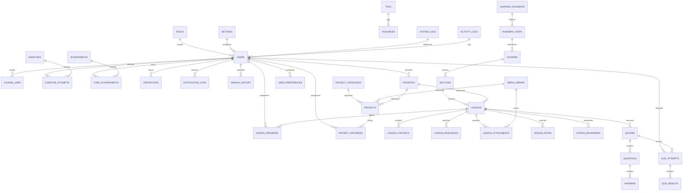

# Database Design

## Purpose

Database planning is critical for Frontend Academy because it creates a shared blueprint for how information is stored, connected, and maintained. A robust database plan supports maintainability by making data ownership and relationships explicit, which helps developers and AI agents reason about the system without guessing at schema intent.

Maintainability is achieved when the database design reflects real domain entities and workflows instead of mixing unrelated data together. Clean separation of concerns at the data layer prevents hidden dependencies and simplifies future changes.

Scalability depends on a database architecture that can grow with the product. The plan should support additional content types, user activity data, and analytics without requiring disruptive schema rewrites.

Data integrity is enforced by clearly defined relationships, referential rules, and a consistent approach to soft deletes and timestamps. The database plan should minimize the risk of orphaned records, duplicated state, and inconsistent reporting.

Performance is addressed through an intentional indexing strategy, relationship patterns, and guidance on caching, eager loading, and query optimization. The architecture should support fast reads for content-heavy pages, progress tracking, and search.

AI-friendly development means the database design is documented, predictable, and aligned with the project’s conventions. AI agents should be able to consult this document to understand entity responsibilities and to avoid introducing schema drift.

---

# Database Overview

Frontend Academy uses MySQL as the official relational database engine. MySQL is selected because it offers strong hosting support, mature tooling, reliable transaction behavior, and full compatibility with Laravel’s migration and ORM ecosystem.

The database philosophy prioritizes a normalized, modular model that represents the platform’s educational domain clearly. The structure is designed for a content-driven learning platform where users, courses, lessons, assessments, progress, and administrative records are distinct yet connected through explicit relationships.

Normalization strategy follows a balanced approach: core entities are normalized to prevent duplication, while read-heavy relationships may be denormalized later where performance warrants it. The current plan emphasizes normalized ownership of entities such as courses, lessons, quizzes, exercises, and progress records.

Future scalability is supported by a modular entity model. New features can be introduced as separate entities or pivot relations rather than forcing large table changes. The database design also anticipates the addition of optional systems such as forums, payments, analytics, and multi-language content.

---

# Database Principles

## Single Source of Truth

Each piece of information should have a single authoritative entity. For example, course definition lives in the `courses` domain, while progress is recorded in separate progress entities. This avoids duplicated business rules and inconsistent state.

## Normalization

The design avoids repeating structured content across multiple tables. Entities are separated into logical tables such as `courses`, `lessons`, `quizzes`, and `projects`, with relationships defined through foreign keys.

## Avoid Data Duplication

Duplicate data is used only when it improves read performance and is introduced intentionally. When duplication exists, it must be backed by a clear refresh or recalculation strategy.

## Referential Integrity

Foreign key relationships are the foundation of the model. They ensure that references between entities are valid and that dependent records cannot exist without their parent resources.

## Soft Delete

Soft delete is used for content and user-facing entities that benefit from recoverability, auditability, or historical preservation. Not all entities should be soft deleted, and the policy is described later in this document.

## Auditability

The database should support auditability through timestamps, ownership references, and logging entities. This enables traceability for actions such as content changes, quiz attempts, and achievement awards.

## Extensibility

The schema supports future expansion by defining modular entities and pivot tables that can accommodate optional features such as tags, favorites, search history, and roadmap steps.

## Consistency

Consistency is maintained through naming standards, shared lifecycle conventions, and clear ownership. This makes it easier to reason about related data and to enforce global business rules.

## Security

Security is an integral part of database architecture. Sensitive data is scoped to specific entities, access control is enforced through application policies, and encryption is used when data requires protection at rest.

## Performance

Performance is considered at both the logical and physical levels. Entity relationships are designed for efficient queries, and indexing guidance is included to support common filters, joins, and sorting patterns.

---

# Naming Convention

The project uses consistent naming standards to make the database predictable and easy to navigate.

## Database

The database name should reflect the project and environment, for example `frontend_academy_local`, `frontend_academy_staging`, or `frontend_academy_production`.

## Tables

- Use plural snake_case names: `users`, `courses`, `lesson_progress`, `quiz_results`.
- Use clear nouns that represent the entity: `course_categories`, `project_categories`.

## Columns

- Use snake_case.
- Prefer descriptive names: `user_id`, `published_at`, `completed_at`, `is_active`.
- Avoid abbreviations unless they are widely understood.

## Primary Keys

- Use `id` for integer primary keys.
- Use `uuid` only when a specific use case justifies a globally unique identifier.

## Foreign Keys

- Use `<entity>_id` naming, for example `course_id`, `lesson_id`, `quiz_id`.
- Foreign keys should reference the `id` column of the related table.

## Pivot Tables

- Use alphabetical order for pivot table names: `course_user`, `taggables`.
- Include the two related entity names separated by an underscore.

## Indexes

- Name indexes with a consistent pattern, e.g. `idx_users_email`, `fk_lessons_course_id`, `uq_courses_slug`.
- Use meaningful index names that reflect the columns included.

## Constraints

- Use descriptive names for foreign keys and unique constraints.
- Example: `fk_lesson_progress_user_id` and `uq_courses_slug`.

## Migration Files

- Use a clear migration naming pattern, for example `2026_07_03_000000_create_courses_table.php`.
- Migration class names should describe the action and entity, such as `CreateCoursesTable` or `AddPublishedAtToCoursesTable`.

Examples:

- Table: `course_categories`
- Foreign key column: `category_id`
- Pivot table: `course_user`
- Index: `idx_courses_published_at`
- Constraint: `fk_quiz_attempts_user_id`

---

# Entity Relationship Overview

The database structure is organized around content delivery, user progress, assessments, and platform metadata. The following Mermaid ER diagram illustrates the major entity relationships.

This diagram represents the major structural relationships among users, content, assessments, progress tracking, and platform metadata. Pivot tables such as `taggables` and `course_user` support many-to-many associations.

---

# Core Entities

This section explains the purpose, responsibilities, relationships, lifecycle, and future expansion for every core entity.

## Users

Purpose: Represents authenticated learners, administrators, and future platform roles.

Business Responsibility: Owns user identity, authentication state, profile data, and associations with learning activity, achievements, notifications, and preferences.

Relationships: owns roles, progress records, quiz attempts, exercise attempts, project progress, achievements, certificates, notification logs, search history, favorites, and preferences.

Lifecycle: created on registration or administrative provisioning, updated as profile or role information changes, soft deleted when accounts are suspended or removed, and retained for auditability.

Future Expansion: may include instructor metadata, organization membership, API tokens, and OAuth credentials.

## Roles

Purpose: Defines user roles and access levels.

Business Responsibility: Drives authorization decisions and scope-based permissions.

Relationships: assigned to users and may be associated with future permissions.

Lifecycle: generally created during platform configuration and updated as role definitions evolve.

Future Expansion: may introduce finer-grained permissions or role hierarchies.

## Permissions (future)

Purpose: Represents discrete permission grants for feature-level access control.

Business Responsibility: Enables granular authorization across platform capabilities.

Relationships: associated with roles and potentially directly with users.

Lifecycle: created and managed as access policies evolve.

Future Expansion: may support dynamic permission assignment for admins, instructors, and moderators.

## Courses

Purpose: Encapsulates curriculum-level learning experiences.

Business Responsibility: Owns course metadata, publication state, prerequisites, and associations with sections, lessons, progress, projects, and roadmaps.

Relationships: contains sections, can appear in roadmap steps, and may be tagged or categorized.

Lifecycle: created during content authoring, published when ready, updated over time, and soft deleted if retired.

Future Expansion: may support course versions, cohorts, and localized course variants.

## Sections

Purpose: Groups lessons within a course for logical sequencing.

Business Responsibility: Defines modular course structure and lesson order.

Relationships: belongs to courses and contains lessons.

Lifecycle: created as courses are architected, reordered as content evolves, and soft deleted with course maintenance.

Future Expansion: may include milestones, progress thresholds, or section-specific metadata.

## Lessons

Purpose: Represents individual learning units.

Business Responsibility: Owns lesson metadata, content relationships, and associations with progress, quizzes, resources, and bookmarks.

Relationships: belongs to sections, contains lesson contents, resources, attachments, notes, bookmarks, and progress.

Lifecycle: created and edited by content authors, published, and soft deleted when retired.

Future Expansion: may include interactive lesson types or alternate presentation modes.

## Lesson Contents

Purpose: Stores structured content pieces within lessons.

Business Responsibility: Manages the building blocks of a lesson such as text sections, code examples, and media references.

Relationships: belongs to lessons.

Lifecycle: created as lessons are authored and updated when content is revised.

Future Expansion: may support multiple content blocks, content ordering, or content versioning.

## Lesson Resources

Purpose: Represents supplemental material attached to lessons.

Business Responsibility: Provides additional learning references, downloads, or external links.

Relationships: belongs to lessons.

Lifecycle: created and managed alongside lesson content.

Future Expansion: may support resource metadata such as type, source, and access controls.

## Lesson Attachments

Purpose: Stores files or media associated with lessons.

Business Responsibility: Links media assets from the media library or uploads to lesson content.

Relationships: belongs to lessons and references media library entries.

Lifecycle: created when attachments are added and removed or soft deleted when no longer relevant.

Future Expansion: may include support for multiple attachment types and storage backends.

## Lesson Notes

Purpose: Captures learner-generated notes tied to lessons.

Business Responsibility: Preserves user annotations and personal learning notes.

Relationships: belongs to users and lessons.

Lifecycle: created by learners during study, updated over time, and optionally deleted.

Future Expansion: may support note sharing, rich text, and private/public visibility.

## Lesson Bookmarks

Purpose: Records learner bookmarks for lesson content.

Business Responsibility: Supports user progress and revisitation workflows.

Relationships: belongs to users and lessons.

Lifecycle: created when users bookmark lessons and removed when bookmarks are cleared.

Future Expansion: may support bookmark categories or saved study sets.

## Lesson Progress

Purpose: Tracks learner completion state for lessons.

Business Responsibility: Records progress milestones, completion timestamps, and status.

Relationships: belongs to users and lessons.

Lifecycle: created as users engage with lessons and updated when status changes.

Future Expansion: may support partial progress, time spent, and mastery levels.

## Quizzes

Purpose: Defines assessment instruments associated with lessons or courses.

Business Responsibility: Owns quiz metadata, scoring rules, and relationships with questions and attempts.

Relationships: belongs to lessons or courses and contains questions and quiz attempts.

Lifecycle: created during content design, updated as assessments change, and soft deleted if retired.

Future Expansion: may support adaptive quizzes and question pools.

## Questions

Purpose: Models individual quiz questions.

Business Responsibility: Stores the question prompt type and behavior.

Relationships: belongs to quizzes and contains answers.

Lifecycle: created during quiz authoring and updated as assessment content evolves.

Future Expansion: may include multiple question types, metadata, and scoring weights.

## Answers

Purpose: Represents selectable or expected responses for quiz questions.

Business Responsibility: Defines valid answer options and feedback.

Relationships: belongs to questions.

Lifecycle: created when questions are authored and updated with question revisions.

Future Expansion: may support graded feedback, answer hints, and answer types.

## Quiz Attempts

Purpose: Records each learner’s submission of a quiz.

Business Responsibility: Captures attempt metadata, timing, and association with users and quizzes.

Relationships: belongs to users and quizzes and contains quiz results.

Lifecycle: created when a learner starts or submits a quiz and retained for reporting.

Future Expansion: may support attempt revision, retry limits, and completion states.

## Quiz Results

Purpose: Stores the outcome of quiz attempts.

Business Responsibility: Records scores, correctness, and result metadata.

Relationships: belongs to quiz attempts.

Lifecycle: created when a quiz attempt is evaluated and retained for reporting.

Future Expansion: may support detailed item scoring and analytics.

## Coding Exercises

Purpose: Defines programming exercises that complement lessons.

Business Responsibility: Owns exercise prompts, validation criteria, and related metadata.

Relationships: related to lessons and has exercise attempts.

Lifecycle: created during content authoring and updated as exercises are refined.

Future Expansion: may support multiple exercise types, sandbox configuration, and auto-grading rules.

## Exercise Attempts

Purpose: Tracks learner submissions for coding exercises.

Business Responsibility: Captures attempt status, validations, and feedback.

Relationships: belongs to users and exercises.

Lifecycle: created with each learner submission and retained for progress tracking.

Future Expansion: may support revision history and submission review.

## Projects

Purpose: Models practical project assignments and portfolio work.

Business Responsibility: Owns project descriptions, requirements, and learning outcomes.

Relationships: belongs to categories and has project progress records.

Lifecycle: created by content authors and updated as projects evolve.

Future Expansion: may support learner submissions, review comments, and project templates.

## Project Categories

Purpose: Organizes projects into thematic groups.

Business Responsibility: Provides classification and filtering for project content.

Relationships: contains projects.

Lifecycle: created during content organization and updated as new project types emerge.

Future Expansion: may support nested taxonomy or skill-based categories.

## Project Progress

Purpose: Tracks learner engagement with projects.

Business Responsibility: Records completion state, review status, and milestones.

Relationships: belongs to users and projects.

Lifecycle: created as learners begin project work and updated through completion.

Future Expansion: may support assessor reviews and portfolio linking.

## Achievements

Purpose: Defines milestone rewards and recognition.

Business Responsibility: Owns achievement criteria, metadata, and display properties.

Relationships: connected to user achievements.

Lifecycle: created by platform design and updated as reward programs evolve.

Future Expansion: may include badge tiers, streak achievements, and season-based awards.

## User Achievements

Purpose: Records awarded achievements for learners.

Business Responsibility: Captures the association between users and earned achievements.

Relationships: belongs to users and achievements.

Lifecycle: created when user criteria are met and retained for recognition.

Future Expansion: may support achievement expiry or historical snapshots.

## Certificates

Purpose: Represents earned certificates and completion recognition.

Business Responsibility: Stores certificate issuance metadata and status.

Relationships: belongs to users and may reference completed courses or learning paths.

Lifecycle: created when learners meet certificate criteria and retained as an audit trail.

Future Expansion: may support certificate verification and shareable credentials.

## Learning Roadmaps

Purpose: Defines structured learning pathways.

Business Responsibility: Owns roadmap metadata and maps progression through courses and topics.

Relationships: contains roadmap steps.

Lifecycle: created during curriculum design and updated over time.

Future Expansion: may support personalized paths and adaptive recommendations.

## Roadmap Steps

Purpose: Represents ordered milestones within a roadmap.

Business Responsibility: Links roadmaps to courses or learning checkpoints.

Relationships: belongs to learning roadmaps and references courses or other content units.

Lifecycle: created when roadmaps are composed and updated as paths evolve.

Future Expansion: may support dependencies, prerequisites, and conditional progress rules.

## Notifications

Purpose: Defines notification templates and system-level notification behavior.

Business Responsibility: Owns notification metadata, channels, and content structures.

Relationships: used by notification logs.

Lifecycle: created as notification types are needed and updated with communication policies.

Future Expansion: may support multi-channel template management and notification scheduling.

## Notification Logs

Purpose: Records delivered notification events.

Business Responsibility: Captures notification delivery state, recipients, and timestamps.

Relationships: belongs to users and references notifications.

Lifecycle: created when notifications are dispatched and retained for audit and troubleshooting.

Future Expansion: may support retry status and delivery analytics.

## Settings

Purpose: Stores platform configuration values and user-specific settings.

Business Responsibility: Maintains configurable application state and user preferences.

Relationships: may be scoped to global settings or user settings.

Lifecycle: created during platform setup and updated through administrative actions.

Future Expansion: may support environment-specific settings, feature toggles, and localized configuration.

## System Logs

Purpose: Captures application-level events and errors.

Business Responsibility: Stores structured system metadata for diagnostics and audit.

Relationships: may reference users or requests.

Lifecycle: created by system events and retained according to log retention policy.

Future Expansion: may support structured event logging and external log integration.

## Activity Logs

Purpose: Records user activity and platform interactions.

Business Responsibility: Tracks meaningful actions for auditing, analytics, and support.

Relationships: belongs to users and may reference content entities.

Lifecycle: created during user actions and retained per audit policy.

Future Expansion: may support event categories, severity levels, and review workflows.

## Media Library

Purpose: Catalogs uploaded media assets and file references.

Business Responsibility: Stores metadata for files used across lessons, projects, and attachments.

Relationships: referenced by lesson attachments and project assets.

Lifecycle: created when media is uploaded and updated with storage metadata.

Future Expansion: may support multiple storage backends, access control, and versioned media.

## Tags

Purpose: Provides a flexible labeling system for content.

Business Responsibility: Enables tagging of courses, lessons, projects, and other entities.

Relationships: associated with entities through the `taggables` pivot.

Lifecycle: created as taxonomy is defined and updated as tags evolve.

Future Expansion: may support hierarchical tags or tag metadata.

## Taggables

Purpose: Supports polymorphic many-to-many relationships for tags.

Business Responsibility: Connects tags to different content entities.

Relationships: belongs to tags and taggable entities.

Lifecycle: created when content is tagged and removed when tags are detached.

Future Expansion: may support tag relevance scores or tagging contexts.

## Favorites

Purpose: Stores user favorites for lessons, courses, or projects.

Business Responsibility: Records content users mark for quick access.

Relationships: belongs to users and references favorite entities.

Lifecycle: created and removed by user interaction.

Future Expansion: may support grouped favorite lists or collection sharing.

## Search History

Purpose: Captures user search activity for analytics and personalization.

Business Responsibility: Logs search queries, filters, and timestamps.

Relationships: belongs to users.

Lifecycle: created by search actions and retained per privacy policy.

Future Expansion: may support search suggestions and behavior-driven recommendations.

## User Preferences

Purpose: Stores user-specific configuration and display preferences.

Business Responsibility: Persists application settings such as notification options, display modes, and learning preferences.

Relationships: belongs to users.

Lifecycle: created with user profile and updated as preferences change.

Future Expansion: may support adaptive learning settings and personalized content filters.

---

# Relationship Strategy

## One to One

One-to-one relationships are reserved for objects that are conceptually exclusive and closely tied to a single owner. Examples include user preferences or user profile extensions. These relationships should be used sparingly.

## One to Many

One-to-many is the primary relationship pattern for the content model. Examples include courses containing sections, lessons containing lesson contents, and users owning quiz attempts.

## Many to Many

Many-to-many relationships are used for reusable associations such as tags, favorites, and user course enrollment. These are represented by explicit pivot tables.

## Pivot Tables

Pivot tables should be simple, normalized join tables with foreign keys to each related primary entity. Examples include `course_user`, `taggables`, and `favoriteables` if needed.

## Cascade Delete

Cascade delete is appropriate for dependent content that has no meaning without its parent. For example, lesson contents should be removed when the parent lesson is deleted permanently.

## Restrict Delete

Restrict delete is used for entities that should not be removed while dependencies exist, such as deleting a course that still has associated lessons or progress records.

## Nullable Relationships

Nullable foreign keys are permitted when relationships are optional by design. For example, a quiz may optionally belong to a course or a lesson.

## Ownership

Ownership rules should be explicit: the owning module is responsible for the lifecycle of its entities. Child entities depend on parent entities through foreign keys and domain rules.

## Dependency Rules

Dependencies must follow the content hierarchy: courses own sections, sections own lessons, lessons own content and assessments, and users own progress and activity records. A clear dependency graph avoids cycles and prevents ambiguous ownership.

---

# Data Ownership

## Course Module

Owns `courses`, `sections`, `lessons`, `lesson_contents`, `lesson_resources`, `lesson_attachments`, `lesson_notes`, `lesson_bookmarks`, `lesson_progress`, and associated content metadata.

## Quiz Module

Owns `quizzes`, `questions`, `answers`, `quiz_attempts`, and `quiz_results`.

## Exercise Module

Owns `coding_exercises` and `exercise_attempts`.

## Project Module

Owns `projects`, `project_categories`, and `project_progress`.

## Achievement Module

Owns `achievements` and `user_achievements`.

## Certificate Module

Owns `certificates`.

## Roadmap Module

Owns `learning_roadmaps` and `roadmap_steps`.

## Notification Module

Owns `notifications`, `notification_logs`, and related notification metadata.

## Settings Module

Owns `settings` and global configuration values.

## Logging Module

Owns `system_logs` and `activity_logs`.

## Media Module

Owns `media_library` and manages media asset metadata.

## Tagging Module

Owns `tags` and `taggables`.

## User Module

Owns `users`, `roles`, `permissions` (future), `search_history`, `favorites`, and `user_preferences`.

---

# Soft Delete Policy

Soft deletes are appropriate for content and user-facing entities where recoverability and auditability are valuable.

### Use Soft Delete for:

- `users` when accounts may be suspended or restored.
- `courses`, `sections`, and `lessons` to preserve historical content references.
- `quizzes`, `coding_exercises`, and `projects` when retired content should remain auditable.
- `article`-style content entities such as `lesson_notes` and `lesson_resources`.
- `notifications` and `notification_logs` when delivery history should be retained.

### Never use Soft Delete for:

- `quiz_results`, `exercise_attempts`, `project_progress`, and other audit/transaction records that represent immutable outcomes.
- `system_logs` and `activity_logs`, which should remain append-only.

### Reasons

Soft delete preserves recoverable state while keeping foreign key relationships intact. Immutable records and log tables should use hard delete only when required by retention policy.

---

# Timestamp Policy

The database uses consistent timestamp conventions.

## created_at

Indicates when the record was first created. It is required for all entities and supports auditability.

## updated_at

Indicates the last modification time. It is required for mutable entities and supports synchronization and caching decisions.

## deleted_at

Used by soft delete-enabled entities to mark logical deletion while preserving the row.

## published_at

Used for content entities that become publicly available, such as courses, lessons, projects, or quizzes.

## completed_at

Used for progress-related records to mark when a learner completed a lesson, exercise, project, or quiz.

## verified_at

Used when a record requires manual or system verification, such as verified completion or certificate validation.

## issued_at

Used for certificates and award issuance events.

---

# UUID Policy

UUID adoption is not required for the initial project model. Integer primary keys are preferred for the core relational tables because they are efficient, easy to index, and align with Laravel’s default conventions.

## Advantages of UUID

- Globally unique identifiers across distributed systems.
- Useful for public references where internal IDs should remain hidden.

## Disadvantages of UUID

- Larger storage and index size.
- Reduced performance for some database operations compared to integer keys.
- More complex application logic if used inconsistently.

## Future migration strategy

If UUIDs are needed later, the architecture should introduce them selectively for external-facing identifiers while preserving integer keys for internal relationships. A migration path may include adding `uuid` columns to entities such as `courses`, `users`, or `certificates` and using them only where required.

---

# Indexing Strategy

A sound indexing strategy improves query performance while minimizing write overhead.

## Primary Keys

Every table uses a primary key, usually `id`, to uniquely identify rows.

## Foreign Keys

Foreign key columns are indexed to optimize joins between related entities.

## Composite Indexes

Composite indexes are used where queries filter on multiple columns together, such as `(user_id, lesson_id)` or `(quiz_id, user_id)`.

## Search Optimization

Indexes should support common search patterns and filters. For example, indexing lesson slugs, course publish status, and user activity timestamps.

## Sorting

Indexes should support sorting columns used in common queries such as `published_at`, `created_at`, and `updated_at`.

## Filtering

Indexes should support frequent filters on foreign keys, status fields, and unique constraints.

## Unique Constraints

Unique constraints enforce data rules such as unique course slugs, unique user emails, and unique achievement codes.

## Performance Considerations

Index only the columns needed for query performance. Excessive indexing increases storage and slows writes. Balance read performance with write cost.

---

# Search Strategy

Search support is planned in stages and should be introduced only when query patterns justify it.

## Keyword Search

Keyword search can begin with database-supported LIKE queries and optimized search indexes for title, description, and metadata fields.

## Full-text Search

Full-text search is a future option for content-heavy entities such as lesson text and course descriptions.

## Meilisearch

Meilisearch is a future candidate for lightweight search needs if the project requires fast, developer-friendly search across courses, lessons, and content.

## ElasticSearch

ElasticSearch is a later-stage option for more complex search and analytics requirements, such as advanced filtering and ranking.

## Search Indexes

Search indexes should be designed around the entities that deliver user-facing search results: courses, lessons, projects, and content metadata.

---

# Data Validation Strategy

Data validation belongs at multiple layers to ensure correctness and resilience.

## Frontend Validation

Frontend validation improves user experience by catching simple errors early. It should never replace server-side validation.

## Form Requests

Laravel form requests are the authoritative layer for validating input before it reaches the application logic. They enforce required fields, formats, and permission-based rules.

## Database Constraints

Database constraints such as foreign keys, unique constraints, and required fields enforce data integrity at the storage layer.

## Business Rules

Business rules live in services and domain logic. They ensure that data relationships are valid and that entity state transitions follow application rules.

---

# Data Integrity Rules

## Required Relationships

Required relationships must be enforced when an entity cannot exist independently. Example: `lesson_progress` requires a valid user and lesson.

## Deletion Rules

Deletion rules must prevent unintended data loss. Use cascade delete only when child entities are truly dependent on a parent, otherwise use restrict delete.

## Consistency Rules

Consistency rules should ensure that related state is synchronized. Example: a completed quiz attempt should not exist without a corresponding quiz.

## Duplicate Prevention

Use unique constraints and application checks to prevent duplicate records for entities such as user email addresses, course slugs, and tags.

## Orphan Prevention

Foreign keys and cascade/restrict policies should prevent orphaned child records.

---

# Seeding Strategy

The seeding strategy establishes baseline data for different environments.

## Reference Data

Seed stable reference data such as roles, achievement definitions, notification templates, and roadmap structures.

## Demo Data

Seed sample courses, lessons, quizzes, and projects for development and demonstration purposes.

## Development Data

Use factories and seeders to populate representative learning scenarios that are safe for local development.

## Production Data

Production seeders should only create essential system records, not demo content.

## Factories

Factories should generate realistic sample records for users, courses, lessons, and progress entities.

## Seeders

Seeders should separate environment-specific data from core reference data to avoid deploying demo content in production.

---

# Migration Strategy

The migration strategy is centered on version-controlled schema evolution.

## Version Control

All migrations are committed to source control and reviewed as part of feature changes.

## Migration Naming

Use descriptive migration filenames and class names that clearly state the intent, such as `create_courses_table` or `add_published_at_to_lessons`.

## Rollback

Rollback support is useful during development, but production changes should be deployed with caution. Migrations should include reversible operations when possible.

## Forward-only changes

Prefer forward-only migrations for complex schema changes in production if rollback is unsafe. Use separate migrations for cleanup and refactoring.

---

# Backup Strategy

A reliable backup strategy protects the database against data loss.

## Database Backup

Perform regular backups of the MySQL data store and transaction logs.

## Retention

Retain backups according to the environment and compliance needs, with longer retention for production.

## Recovery

Document recovery procedures and validate restore operations periodically.

## Disaster Recovery

Plan for disaster recovery with offsite snapshots, failover procedures, and clear escalation paths.

## Future Cloud Backup

Future cloud backup may be adopted when moving to managed database services or when the infrastructure requires automated snapshot policies.

---

# Performance Strategy

Performance is addressed through data access patterns and schema design.

## Pagination

Use pagination for large result sets such as lessons, courses, and user activity.

## Lazy Loading

Avoid N+1 queries by using lazy loading only when appropriate. Prefer eager loading for related entities used in the same request.

## Eager Loading

Eager load relationships that are needed for a view or API response to minimize database round trips.

## Caching

Cache stable read data and metadata when appropriate, while ensuring cache invalidation rules are clear.

## Indexes

Support common query paths with well-chosen indexes.

## Query Optimization

Review slow queries and optimize them through joins, indexes, or denormalized summary tables when necessary.

## Archive Strategy

Consider archiving or summarizing old activity and log data if datasets grow significantly.

---

# Security Strategy

Security is essential for database architecture.

## Sensitive Data

Minimize storage of sensitive data and limit its scope to the entities that require it.

## Password Hashing

Store hashed passwords using Laravel’s built-in hashing mechanisms.

## Access Control

Enforce access control through application policies and ensure that data access reflects authorization rules.

## Data Privacy

Handle personal data in accordance with privacy requirements and retain only what is necessary.

## Encryption

Use encryption for sensitive fields when the application requires protection at rest.

## SQL Injection Protection

Protect against SQL injection by using parameterized queries, Eloquent ORM, and query builder methods.

## Audit Logging

Maintain audit logging for security-relevant events and modifications to important entities.

---

# Future Database Expansion

The current architecture supports future expansion by keeping entities modular and relationships explicit.

## Forum

Forum entities can be added as separate tables with relationships to users and courses.

## Discussion

Discussion content can be modeled as message threads connected to course or lesson content.

## Comments

Comments may attach to lessons, projects, quizzes, or other content entities.

## Messaging

Messaging can be introduced as a separate entity with user-to-user conversations and notifications.

## Subscription

Subscription entities may be added for plan billing and access control.

## Payments

Payments and invoices can be added as separate financial entities.

## Invoices

Invoices should be modeled independently from payments and subscriptions.

## Coupons

Coupons can be introduced with redemption tracking and validity rules.

## Multi-language

Multi-language support may be added by separating content into language-specific entities or translation tables.

## Multi-tenancy

Multi-tenancy can be supported later through tenant-scoped data partitions or shared schema with tenant identifiers.

## API Tokens

API tokens may be added for external integrations and service authentication.

## OAuth

OAuth entities can support third-party authentication and authorization.

## Learning Analytics

Analytics entities can store event summaries, learner behavior, and performance metrics.

## AI Tutor

AI tutor entities can be introduced for personalized recommendations, session history, and adaptive learning state.

The current model is intentionally modular so that these future entities can integrate without disrupting core course, user, or progress structures.

---

# Database Decision Records

## Decision: Use MySQL as the core relational database

Reason: MySQL offers broad hosting compatibility, mature tooling, and strong integration with Laravel.

Benefits: reliable production support, predictable schema evolution, and operational familiarity.

Trade-offs: less advanced feature set than PostgreSQL in some areas, but sufficient for the project’s initial domain.

Alternatives Considered: PostgreSQL, SQLite, MariaDB.

## Decision: Normalize core content entities

Reason: Normalization prevents duplicated content definitions and keeps content ownership clear.

Benefits: easier maintenance, consistent relationships, and clear entity responsibilities.

Trade-offs: requires more joins for complex queries, but this is manageable with an indexing strategy.

Alternatives Considered: denormalized content blob storage.

## Decision: Prefer integer primary keys over UUIDs

Reason: Integer keys are efficient and compatible with Laravel conventions.

Benefits: simpler queries, smaller indexes, and easier debugging.

Trade-offs: less innate global uniqueness for externally referenced records.

Alternatives Considered: UUID primary keys, hybrid ID strategy.

## Decision: Adopt a soft delete policy for content entities

Reason: Soft deletes preserve content history and recoverability for lesson and course resources.

Benefits: safer content lifecycle management and audit trails.

Trade-offs: requires careful query filtering to exclude deleted records.

Alternatives Considered: hard delete only, archive tables.

---

# AI Development Rules

AI agents must adhere to the official database plan.

- AI Agents must never create new tables without checking this document.
- Every migration must follow this database plan and align with the defined entity responsibilities.
- Relationships must remain consistent with the ownership and dependency rules documented here.
- Naming conventions must be respected for tables, columns, foreign keys, and indexes.
- Database integrity must never be compromised by introducing unsupported relationships or schema patterns.

---

# Revision History

| Version | Date | Author | Notes |
|---|---|---|---|
| 1.0 | 2026-07-03 | Frontend Academy Team | Initial database architecture reference for Frontend Academy. |
